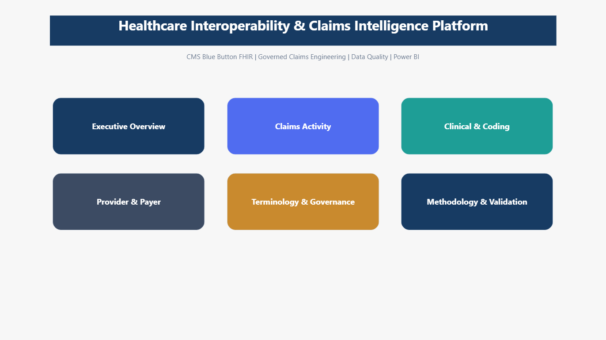

# Healthcare Interoperability & Claims Intelligence Platform

[](https://github.com/khaledzidan203-stack/healthcare-interoperability-claims-intelligence/actions/workflows/ci.yml)


> Portfolio visual summary of the project architecture, stack and analytical delivery.

A production-style **healthcare interoperability, claims analytics and analytics-engineering portfolio project** built on **CMS Blue Button sandbox/synthetic FHIR data**.

The project demonstrates how nested healthcare interoperability resources can be converted into governed, traceable analytical facts and delivered through **Python, PostgreSQL, dimensional modeling, data-quality controls, Power BI, DAX, PBIP/PBIR/TMDL and GitHub Actions**.

> **Portfolio scope:** synthetic sandbox data only. The project demonstrates engineering, governance and analytical design; it does not claim production CMS access, clinical inference or consolidated financial outcomes.

## Project at a glance

| Area | Current implementation |
|---|---|
| Business problem | Turning nested claims/interoperability data into trustworthy analytical facts without double counting or invented identity |
| Healthcare data | CMS Blue Button, FHIR Patient, Coverage and ExplanationOfBenefit resources |
| Data engineering | Governed ingestion, run isolation, canonical grains, reference normalization, PostgreSQL analytical modeling |
| Data quality | Reconciliation, duplicate/wrong-run controls, source lineage, terminology state preservation |
| BI / analytics | TMDL semantic model, governed DAX, seven-page PBIR Power BI report |
| Engineering quality | 94 regression tests, release auditor, GitHub Actions, security/publication controls |
| Core stack | Python 3.13 · PostgreSQL · SQL · FHIR · OAuth 2.0/PKCE · Power BI · DAX · PBIP/PBIR · TMDL |

**Suggested review path:** start with the dashboard preview below, then review the architecture, engineering highlights and validation evidence.

## Engineering scope

- **Healthcare interoperability data processing** beyond flat analytical extracts.
- **Grain, lineage and run-identity preservation** across a multi-stage analytics pipeline.
- **PostgreSQL analytical modeling** that separates claims, clinical occurrences, care-team, supporting-information and financial grains.
- **Data-quality and reconciliation controls** that fail closed instead of hiding source uncertainty.
- **Governed Power BI semantic modeling and PBIR reporting** over validated analytical structures.
- **Reviewable engineering delivery** with automated tests, CI, documentation and publication controls.

**60–90 second technical walkthrough:** [guided project walkthrough](docs/PORTFOLIO_DEMO_WALKTHROUGH.md).

## Why this project matters

Healthcare claims data is not naturally analytics-ready. FHIR resources contain nested diagnoses, procedures, claim items, care-team participants, financial components and references at different grains. Flattening them into one table can create duplicated counts, invalid joins and misleading financial totals.

This project addresses that problem by preserving source meaning, separating analytical grains, retaining lineage and uncertainty, validating each stage, and exposing the governed result through a source-controlled Power BI semantic model and report.

## What I built

- **FHIR interoperability pipeline** using CMS Blue Button sandbox data with OAuth 2.0 Authorization Code + **PKCE S256**.
- **Governed ingestion and traceability** with run-scoped persistence, page hashes, resource-key reconciliation and source lineage.
- **Canonical claims model** separating claims, items, diagnoses, procedures, care-team, supporting-information and financial grains.
- **PostgreSQL analytical layer** with governed schemas, integrity controls, reconciliation and run isolation.
- **Power BI semantic model** using TMDL/DAX with 22 business tables, a disconnected `_Measures` table and 50 relationships.
- **Seven-page PBIR report** covering executive activity, claims, clinical coding, provider/payer views, terminology/governance and methodology.
- **Automated validation and CI** with 94 regression tests plus a release auditor executed through GitHub Actions.
- **Security/publication controls** that keep credentials and runtime extracts private while preserving reproducible public source and validation evidence.

## Analytical questions supported

The governed model and report support descriptive questions such as:

- How much claims activity exists in the selected governed run?
- How does activity vary over time and by source status, use and outcome categories?
- Which diagnosis and procedure occurrences are represented, and what is their terminology-mapping state?
- What provider, payer and care-team information is present versus unavailable in source display data?
- Which records remain mapping-pending or require governance review?

These are **bounded analytical questions for the synthetic portfolio snapshot**, not clinical, actuarial or population-level conclusions.

## Technology stack

**Python 3.13 · PostgreSQL · SQL · FHIR · CMS Blue Button · OAuth 2.0 / PKCE · Power BI · DAX · Power Query · PBIP · PBIR · TMDL · Git · GitHub Actions**

## Dashboard preview

### Executive Overview

Activity counts and claim-type mix within the governed portfolio snapshot.


### Claims Activity

Claims over time and source status, use and outcome categories.


### Clinical & Coding

Diagnosis and procedure occurrences with explicit mapping-pending status.


### Provider & Payer

Care-team activity and provider/payer identity/display availability while preserving source blanks.


### Terminology & Governance

Source categories, terminology mapping states and governance controls.


## Architecture

```mermaid
flowchart LR
  CMS[CMS Blue Button Sandbox] --> AUTH[OAuth 2.0 + PKCE S256]
  AUTH --> FHIR[Patient / Coverage / ExplanationOfBenefit]
  FHIR --> RAW[Governed RAW + hashes]
  RAW --> STAGE[Canonical STAGING]
  STAGE --> REF[Reference normalization]
  REF --> TERM[Terminology and financial grain controls]
  TERM --> DQ[Data quality and reconciliation]
  DQ --> PG[PostgreSQL analytics]
  PG --> MODEL[TMDL semantic model]
  MODEL --> REPORT[PBIR report]
  REPORT --> AUDIT[Release evidence]
```



## Engineering highlights

### Interoperability
Authorization Code + PKCE, state and granted-scope checks, validated pagination links and bounded retries for Patient, Coverage and ExplanationOfBenefit.

### Grain and modeling discipline
Claims, claim items, diagnosis occurrences, procedures, care-team participants, supporting information and financial elements remain separate where their business grains differ. Contained and external references are normalized without inventing identity from display text.

### Traceability and run isolation
Extraction is run-scoped, source pages are hashed, child sequences are canonicalized, and cross-run aggregation is prohibited. A hidden locked report filter selects one governed run and all nine report measures require one run in context.

### Governance and data quality
Terminology mapping status remains visible rather than being silently coerced. Financial facts remain separated by concept/currency context. Post-load checks cover duplicate keys, wrong-run records and hash/multiset reconciliation.

### Release engineering
The public repository includes reproducible source checks, fixture validation, documentation-link checks, model/report inventory checks and a GitHub Actions workflow that runs the release auditor on Python 3.13.

## Verified source inventory

| Layer | Current inventory |
|---|---|
| Python | 17 modules, 70 top-level functions, 13 classes; no third-party runtime dependencies |
| Regression | 14 test modules; 94/94 pass locally |
| SQL | 5 scripts; 40 CREATE TABLE + 4 CREATE SCHEMA statements; indexes counted separately |
| Semantic model | 22 business tables plus disconnected `_Measures`; 9 measures; 50 relationships |
| Report | 7 pages, 77 visuals; 1920 × 1080, FitToPage |

The governed report snapshot is `snapshot_20261001_portfolio_4patients_v1`. The preserved Desktop screenshots show **4 patients, 24 claims, 87 items, 98 diagnosis occurrences, 12 procedure occurrences, 72 care-team occurrences and 460 supporting-info occurrences**. These numbers are presentation evidence for that bounded snapshot, not population-level findings.

Six measures count activity. Three hidden financial measures are restricted primitives requiring one run, one concept and one currency; they are intentionally not presented as consolidated business KPIs. Coverage remains governed upstream and excluded from semantic relationships.

## Full report walkthrough

### INDEX

Navigation across six analytical and governance sections.



### Methodology & Validation

Methodology, lineage, semantic scope and validation narrative.


The seven published screenshots are preserved as release evidence. Some captures contain selection handles or blank labels; blank labels represent unavailable display information, not inferred identity.

## Review and reproduce

```powershell
$env:PYTHONPATH = 'src'
$env:PYTHONDONTWRITEBYTECODE = '1'
python -B -m healthcare_claims --help
python -B -m unittest discover -s tests
python -B scripts/release/release_audit.py
```

Use Python 3.13 for release checks. No pip installation is required for the current runtime path. See [setup](docs/SETUP.md) for the implemented CLI, SQL prerequisites and Power BI instructions.

The public checkout supports source checks and fixture tests. Private runtime datasets, credentials and cached Power BI model state are intentionally excluded.

## Validation status

- **94/94 pipeline regression tests passed** in the release validation baseline.
- The repository includes a **read-only release auditor** for publication boundaries, source integrity, JSON, fixture hashes, links and model/report inventories.
- **GitHub Actions passed** for the published source validation workflow.
- Power BI source and screenshots are preserved against the approved baseline; detailed PBIR/Desktop evidence boundaries are documented separately.

For the complete evidence record, limitations and provenance, see [Release Validation Evidence](docs/validation/RELEASE_VALIDATION_EVIDENCE.md) and the [Release Checklist](docs/validation/RELEASE_CHECKLIST.md).

## Technical documentation

- [Architecture](docs/architecture/RELEASE_ARCHITECTURE.md)
- [Engineering decisions](docs/architecture/ENGINEERING_DECISIONS.md)
- [Portfolio case study](docs/PORTFOLIO_CASE_STUDY.md)
- [60–90 second project walkthrough](docs/PORTFOLIO_DEMO_WALKTHROUGH.md)
- [Source-derived data dictionary](docs/semantic/RELEASE_DATA_DICTIONARY.md)
- [Repository map](docs/REPOSITORY_MAP.md)
- [Setup and reproducibility](docs/SETUP.md)
- [Security](SECURITY.md)
- [Public source manifest](docs/source/PUBLIC_SOURCE_MANIFEST.md)
- [CMS sample FHIR provenance](docs/source/CMS_SAMPLE_FHIR_PROVENANCE.md)

## Important limitations

Clinical terminology mappings may remain pending. The synthetic sample is not intended for population inference, clinical decisions, production claims adjudication, consolidated financial conclusions or unsupported scalability claims. Production CMS access is outside the demonstrated scope.

Detailed validation boundaries—including preserved Power BI runtime evidence and environment-specific PBIR validation constraints—remain documented in the release evidence rather than being hidden from reviewers.

## Attribution and license

CMS reference files and fixtures retain [source attribution and pinned hashes](docs/source/PUBLIC_SOURCE_MANIFEST.md). Dictionary build `2.248.0` is retained as a historical reference rather than a claim about the latest CMS dictionary. CMS sandbox/API documentation remains the authoritative external reference for the source environment.

Original project code and documentation are licensed under the [MIT License](LICENSE), copyright 2026 Khaled Zidan. External CMS and Power BI generated resources retain their original provenance; see [third-party notices](THIRD_PARTY_NOTICES.md).
