# Healthcare Interoperability & Claims Intelligence Platform

A production-style healthcare interoperability and claims analytics engineering portfolio project using **CMS Blue Button sandbox/synthetic FHIR data**.

The engineering objective is to turn nested claims resources into traceable analytical facts while preserving source meaning, run identity and uncertainty. The result connects a standard-library Python pipeline, PostgreSQL analytical model and source-controlled Power BI application. It demonstrates engineering practice without production, clinical or financial-outcome claims.

## Architecture

```mermaid
flowchart LR
  CMS[CMS Blue Button Sandbox] --> AUTH[OAuth 2.0 + PKCE S256]
  AUTH --> FHIR[Patient / Coverage / ExplanationOfBenefit]
  FHIR --> RAW[Governed RAW + hashes]
  RAW --> STAGE[Canonical STAGING]
  STAGE --> REF[Reference normalization]
  REF --> TERM[Terminology and financial grain controls]
  TERM --> DQ[Data quality and reconciliation]
  DQ --> PG[PostgreSQL analytics]
  PG --> MODEL[TMDL semantic model]
  MODEL --> REPORT[PBIR report]
  REPORT --> AUDIT[Release evidence]
```



## Engineering capabilities

- **Interoperability:** Authorization Code + PKCE, state and granted-scope checks, validated pagination links and bounded retries for Patient, Coverage and ExplanationOfBenefit.
- **Traceability:** run-scoped persistence, page hashes, canonical child sequences and source lineage. Extraction completeness follows next links and resource-key reconciliation because observed sandbox Bundle totals were unreliable.
- **Modeling:** separate claim, item, diagnosis, procedure, care-team, supporting-info and financial grains; contained and external references normalized without inventing identity from display text.
- **Governance:** terminology mapping status stays visible; financial facts remain separate. Transaction rendering and post-load checks cover duplicate keys, wrong-run records and hash/multiset reconciliation.
- **Analytics:** PostgreSQL dimensions and facts feed TMDL and seven PBIR pages. A hidden, locked report filter selects one governed run; all nine measures require one run in context.
- **Release engineering:** a read-only auditor checks source, publication boundaries, fixture hashes, local links, model/report inventories and the 94-test regression suite. GitHub Actions runs reproducible source gates.

## Verified source inventory

| Layer | Current inventory |
|---|---|
| Python | 17 modules, 70 top-level functions, 13 classes; no third-party runtime dependencies |
| Regression | 14 test modules; 94/94 pass locally |
| SQL | 5 scripts; 40 CREATE TABLE + 4 CREATE SCHEMA statements; indexes counted separately |
| Semantic model | 22 business tables plus disconnected `_Measures`; 9 measures; 50 relationships |
| Report | 7 pages, 77 visuals; 1920 × 1080, FitToPage |

The report selects `snapshot_20261001_portfolio_4patients_v1`. The supplied Desktop screenshots show **4 patients, 24 claims, 87 items, 98 diagnosis occurrences, 12 procedure occurrences, 72 care-team occurrences and 460 supporting-info occurrences**. These are bounded snapshot presentation evidence, not a fresh database recount. Private runtime directories were inaccessible for recount during this audit. Cross-run aggregation is prohibited.

Six measures count activity. Three hidden financial measures are restricted primitives requiring one run, one concept and one currency; they are not consolidated business KPIs. Coverage remains governed upstream and excluded from semantic relationships.

## Review and reproduce

```powershell
$env:PYTHONPATH = 'src'
$env:PYTHONDONTWRITEBYTECODE = '1'
python -B -m healthcare_claims --help
python -B -m unittest discover -s tests
python -B scripts/release/release_audit.py
```

Use Python 3.13 for release checks. No pip installation is needed. See [setup](docs/SETUP.md) for the actual CLI, SQL prerequisites and Power BI instructions. The public checkout supports source checks and fixture tests; it omits the private dataset and cached model needed to reproduce populated screenshots directly.

## Report walkthrough

All seven original supplied Desktop screenshots are preserved unchanged. Selection handles and blank labels in some captures are part of the evidence. Blank labels indicate unavailable display information, not an established identity.

### INDEX

Navigation across six analytical and governance sections.


### Executive Overview

Activity counts and claim-type mix within the governed snapshot.


### Claims Activity

Claims over time and source status, use and outcome categories.


### Clinical & Coding

Diagnosis and procedure occurrences with explicit mapping-pending status.


### Provider & Payer

Care-team activity and provider/payer identity and display availability; source blanks remain visible.


### Terminology & Governance

Source categories and terminology mapping gates, including supporting information.


### Methodology & Validation

Methodology, lineage, semantic scope and supplied validation narrative.


## Technical reading

- [Release evidence](docs/validation/RELEASE_VALIDATION_EVIDENCE.md) and [release checklist](docs/validation/RELEASE_CHECKLIST.md)
- [Architecture](docs/architecture/RELEASE_ARCHITECTURE.md) and [engineering decisions](docs/architecture/ENGINEERING_DECISIONS.md)
- [Case study](docs/PORTFOLIO_CASE_STUDY.md) and [source-derived data dictionary](docs/semantic/RELEASE_DATA_DICTIONARY.md)
- [Repository map](docs/REPOSITORY_MAP.md) and [publication plan](docs/validation/PUBLICATION_PLAN.md)
- [Security](SECURITY.md), [public source manifest](docs/source/PUBLIC_SOURCE_MANIFEST.md) and [CMS fixture provenance](docs/source/CMS_SAMPLE_FHIR_PROVENANCE.md)

## Release limits

PBIR and Desktop validation are carried forward from the owner-attested approved baseline after verifying byte identity of all 121 Power BI source files and seven screenshots. The prior PBIR result was exit 0, zero errors and one `PBIR_SCHEMA_UNREACHABLE` warning. Fresh rerun remains blocked by local PowerShell security policy; no bypass was used. The warning concerns remote schema availability, not a structural error. See the [preservation evidence](docs/validation/RELEASE_VALIDATION_EVIDENCE.md) for provenance and limits. Source CI does not run Desktop, PostgreSQL or fresh PBIR validation.

Clinical mappings may remain pending. The synthetic sample cannot support population inference, clinical decisions, consolidated financial conclusions or scalability claims. This project is not a claims adjudication engine or production CMS integration.

## Attribution and license

CMS reference files and fixtures retain [source attribution and pinned hashes](docs/source/PUBLIC_SOURCE_MANIFEST.md). Dictionary build `2.248.0` is a historical reference, not a claim about the latest CMS dictionary. CMS describes its testing data in [Explore the API](https://bluebutton.cms.gov/api-documentation/explore-the-api/).

Original project code and documentation are licensed under the [MIT License](LICENSE), copyright 2026 Khaled Zidan. External CMS and Power BI generated resources retain their original provenance; see [third-party notices](THIRD_PARTY_NOTICES.md). The project license does not expand rights over third-party material.
