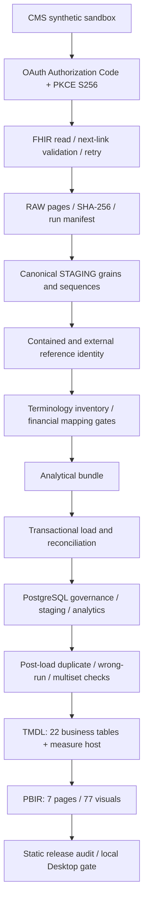

# Release architecture

Status: CURRENT / RELEASE. Source inspected 2026-10-03. No database mutation was performed.

## Python boundaries

| Modules | Responsibility |
|---|---|
| `__init__`, `__main__`, `config` | Package/CLI and `.env` contract; CLI exposes configuration validation and ingestion. |
| `oauth` | PKCE/state, loopback callback, token exchange and granted scopes. |
| `fhir`, `ingest`, `storage` | Bundle traversal, next-link safety, retry-aware reads, orchestration and completed-run persistence with hashes. |
| `staging` | Canonical resource/child grains, sequence checks and source fragments. |
| `reference_normalization` | Source-aware contained/external identity and explicit source limitations. |
| `terminology`, `financial_terminology` | Coding inventory, source families, financial resolution and aggregation rules. |
| `analytical_contract`, `dimensional_model` | Grain, key and relationship contracts. Some historical status constants remain; current deployed-source state comes from SQL/TMDL, not those labels. |
| `analytics_load`, `analytics_db_load` | Dimensions/facts bundle and transactional PostgreSQL load rendering. |
| `analytics_post_load_dq` | SQL for duplicate, run-isolation and hash-multiset checks. |
| `semantic_contract` | Semantic inclusion, relationships and measure governance. |

## Database and grain

Five SQL files contain 40 table-creation statements: 4 governance, 12 STAGING and 24 analytics tables. Four schema statements include a repeated idempotent analytics declaration. The earlier count of 44 therefore covers tables plus schemas, not all CREATE statements: 29 index statements bring the total to 73.

Governance carries run identity, DQ outcomes, source exceptions and reconciliation. STAGING preserves canonical resource/child grain. Analytics has 13 dimensions, 10 facts and one Coverage bridge. Child facts propagate dimension keys; parent identifiers remain lineage rather than fact-to-fact semantic joins. Financial totals and adjudications stay separate.

Coverage exists upstream but is excluded from the semantic model. TMDL contains 12 business dimensions, 10 facts and a disconnected empty `_Measures` host. Of 50 relationships, 45 are active and 5 are inactive date roles. The report selects `snapshot_20261001_portfolio_4patients_v1`; older runs must not be combined into its measures.

## Validation boundaries

Unit tests exercise transformations, contracts, SQL rendering and reconciliation without live services. Source checks cover syntax, imports, JSON, inventory, publication boundaries and hashes. Screenshots support presentation claims for the supplied sample. None independently proves current database contents, successful refresh or full remote PBIR schema validation.

The auditor avoids credentials, private runtime artifacts, database and network. PBIR validation and Desktop review are carried forward only when the complete source/screenshot baseline remains byte-identical; any change reopens the local validation gate. See [release evidence](../validation/RELEASE_VALIDATION_EVIDENCE.md) and [data dictionary](../semantic/RELEASE_DATA_DICTIONARY.md).
